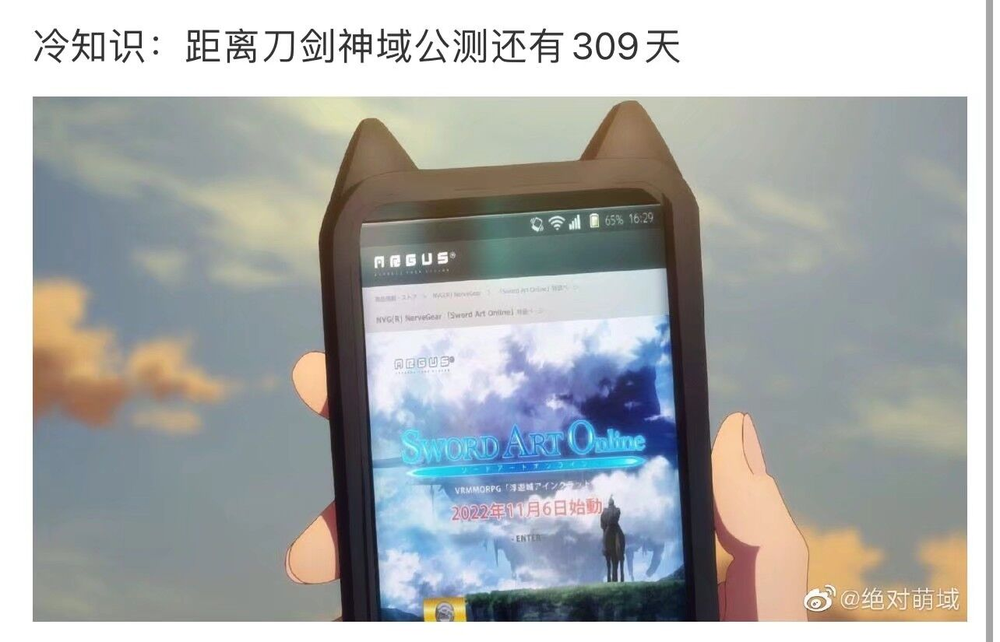

这一个礼拜，我好像从来没有冒出“该写点什么了”的念头。写完 2021 的总结，好像这个博客的任务就已经完成了（笑）。



## 关于做题
最近一周刚开始做 leetcode，简单题和中等还能做一做，困难题基本没思路。而且各种内存溢出、run time error 很是让人恼火。

目前为止做了以下题目：

#### easy 13. 罗马数字转整数
- 简单题，要理清罗马数字的逻辑。把罗马数字用到的字母放入一个表中，从左往右的读取过程中：如果本次读取的字母所代表的数字，小于下一次读取的字母所代表的数字，则减去该字母代表的数值，否则加上该数值。总结起来简单，做的时候还是想了挺久，而且还有大概一半的时间在 debug。

#### medium 1185. 一周中的第几天
- leetcode 的每日一题。有两种方法，一种是设定一个基准日，比如 1970 年 12 月 31 日是周四，再计算所给日期距离 1970/12/31 的天数，就是要注意每月天数不同以及闰年的影响，最后用 7 取余即可。另一种方法是蔡司公式，一个算式可以算 15 世纪以后任何一天是周几。（确实几乎没人会把这公式背下来吧！）
- 答题虽然简单，但是 `char * week[7];` 总是报错，好像 vscode 不支持这样定义一周七天。后来用了 `switch` 语句，还是报错。最后发现 `switch` 语句结束后还要再 `return ' '` 加一个空格才行。神奇。

#### medium 2. 两数相加
- 梦开始的地方。是用链表存储的两个数相加，每位对应相加，并加上进位就行。需要注意最后一位如果还有进位，要多申请一个内存空间来存储最后一位。用 `malloc` 也是怎么写都报错，抄官方答案都不行，唉。
- 一开始以为链表是从高位到低位存储，我还先写了一个 `reverse` 函数，后来发现用不上（笑）。
- 涉及两个链表操作的题目，按照我之前看数据结构的惯性，是想等两个链表其中一个到结尾后，把还未结尾的那个直接接上
  ```
    if (q->next != NULL)
        p->next = q->next; 
  ```
  可是实际上，leetcode 给的链表好像是不带头节点的，到链表结尾的时候，`p` 已经是 `NULL` 了，会导致无效指针的错误。这也是我做题遇到的最多的问题之一了。

#### medium 3. 无重复字符的最长子串
- 看到题目想的是这和 KMP 算法有点像，真要套用的话又有点无从下手。最基础的方法是一次遍历检查。进阶一点可以定义一个 `int map[128] = {0};` ，因为 ASCII 码不会超过 128，接着就是设定头指针 `i` 尾指针 `j` 以及字符串长度 `max`，没有重复字符 `j++` ，有重复就 `i++` 直到没有重复；如果 `j - i > max` ,就把最大长度替换。

#### medium 5. 最长回文串
- 这题好像没有简单的方法（题解里提到 Manacher 算法我没看懂QAQ），最终还是要分单双遍历字符串，每个字符从中心扩散，用嵌套查找每个字符最长的回文串，再选取最大的那个。
- 有个做法是在所有的间隙、包括头尾插入“#”，这样所得字符串必定是奇数为中心，再遍历就不必分区分单双了。

#### medium 6. Z 字型变换
- 这是我目前觉得最有意思的一题。我一开始的想法是搞一个矩阵，先把字符按照规律 Z 字型写进去，然后逐行读出非空的字符。写算法的时候研究了好久矩阵的列数该如何计算，奈何最后倒在了没法把矩阵所有位置初值设为 `'\0'`,`malloc` 和 `memset` 杀我，啊。
- 后来（看题解）发现规律其实很简单：从零开始给初始字符串编号的话，每行字符的编号除以 `2 * numRows - 2` 的余数，是行号或者除数减去行号，利用这个规律就可以简单地逐行读出变换后的字符。
  ```
    if(n % p == m || n % p == p - m)  // p = 2 * numRows - 2
        ss[x++] = s[n];               // ss 是变换后的字符串，s 是原字符串
  ```

#### hard 913. 猫和老鼠
- 关于图、深度优先搜索的题目。概念我还能理解，自己上手真不知道该怎么做。最后对着题解照抄“学习”了一番。求放过啊。


## 一些瞎想
许久之前参加过网易游戏部门，游戏策划的面试，当时我还自诩是资深二次元手游玩家，可惜面试官的问题和我准备的方向风马牛不相及。最近突然想到一些，做策划最重要的还是口胡嘛！
> 当时的问题：恰逢过年，如果你给明日方舟设计符合春节活动的新干员，你有什么想法？

我当时想到新干员，脑子里只剩下 dota 里新出的墨客，说是中国风，带毛笔穿铠甲，结果带着日式鬼神的面具，让人无力吐槽。毕竟舟也致敬了一些 dota 的内容嘛，比如猎蜂技能致敬拍拍被动，陈技能致敬无敌斩等等。那时候舟的活动是“地生五金”，限定干员是“年”和“阿”，我就照着墨客说呗，出个对抗年兽的干员。技能就一个命运之笔，在面前划出一条直线，击中单位越多伤害越高；墨涌这技能其实也挺适合方舟，但是两个同时致敬的话，也不太好。

结果面试官想听的是这干员的形象、外貌描述，大概的身份背景这些。坦白讲，我真没刻意留意过游戏角色的背景这些内容，其实也不太关心角色都长啥样，大概好看就行（。面试官还说，过年喜气洋洋的，我这来个墨水黑漆漆，不合适。我这绞尽脑汁，那就把墨水换成爆竹吧，技能动画就是一串爆竹噼里啪啦炸过去，更多的我实在想不出来了。

现在我想出来了，因为我学了点算命（不是）。比如说，地生五金，那来年的五行就是“金生水”，2022 年是壬寅年，壬是阳水，水代表的颜色是黑色，设计一个和墨水有关的干员代表新的一年，很合适嘛。形象的话，就用老虎咯。用墨水画老虎，名字就叫画虎吧。又或者，冬天用墨水画画，自然是画腊梅，设计一只梅花鹿也无不可。角色也要讲究文武相济，鹿属文，命运之笔给他，设计成高台角色；虎是武，那就是近战了。另外，水属肾，这只虎要设计得走肾，要色气一点。最后算来历，如果这俩来自同一个地方，可以是秀才鹿遇到美少女虎将。现在回看，舟和九色鹿联动了，另外也有个福瑞老虎，也许是巧合吧。
有个笑话说，编剧写剧情前先给每个人物定了生辰八字，不知道剧情怎么发展的时候就给角色算一算，命里该有一劫啊！

## 广告时间
虽然博客没人看，视频也没人看，但还是在这里给自己打个广告吧。两年前的旅游，记忆是如此遥远。

<iframe 
src="//player.bilibili.com/player.html?aid=295404289&bvid=BV18F411q7Rq&cid=478835119&page=1" 
scrolling="no" 
border="0" 
frameborder="no" 
framespacing="0" 
allowfullscreen="true"
height=600 
width=800> 
</iframe>