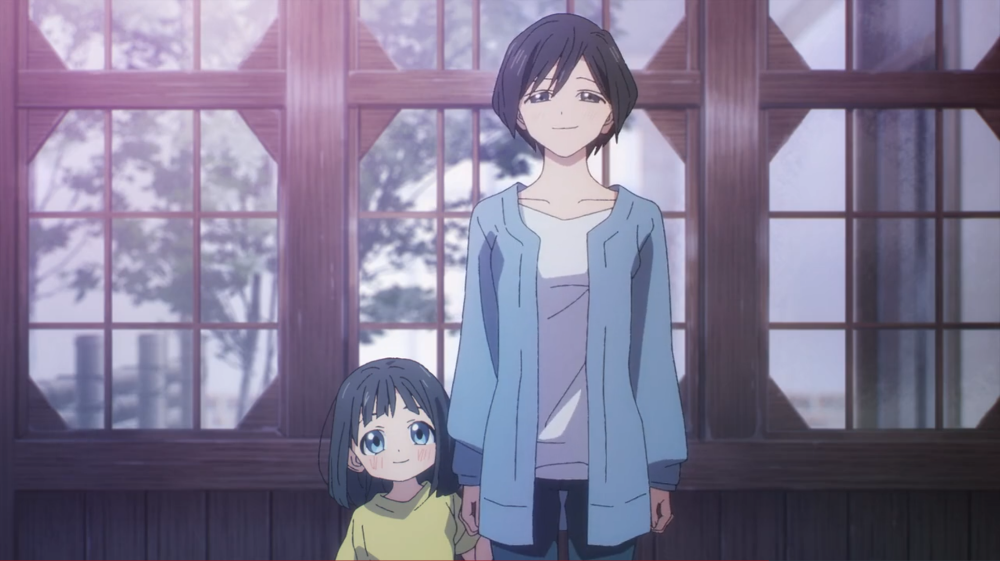
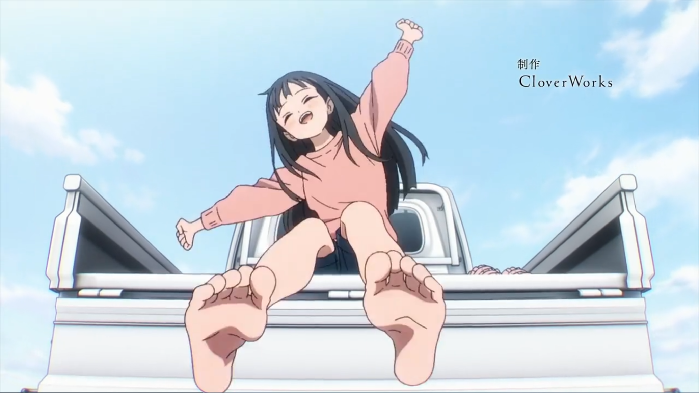
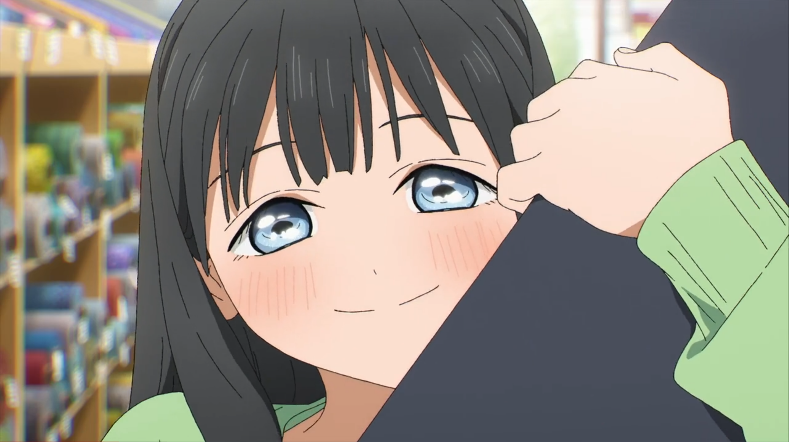
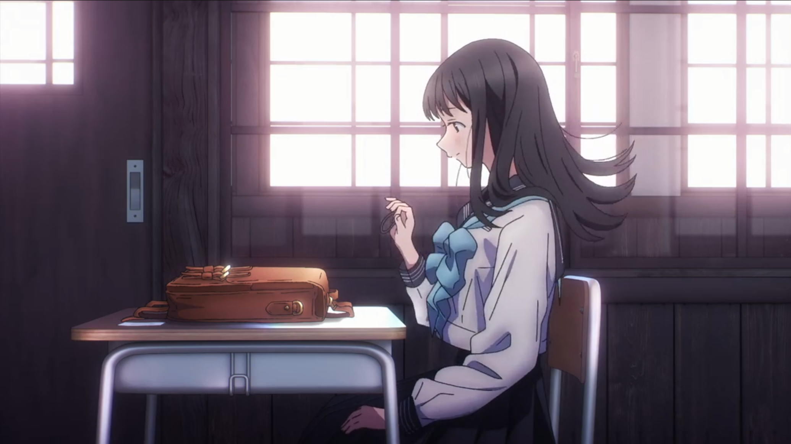
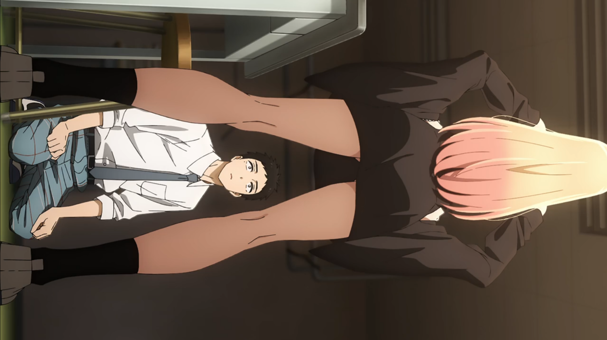
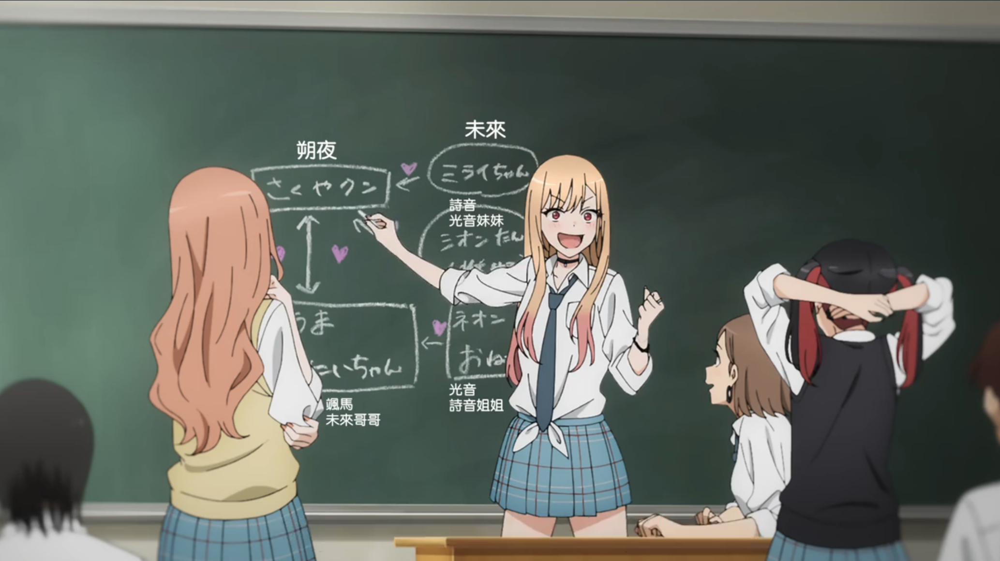
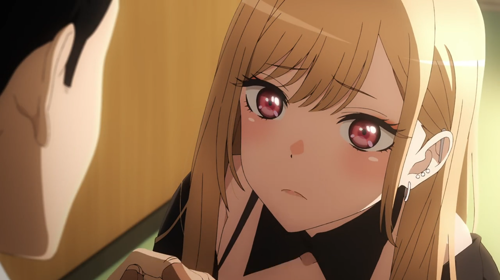
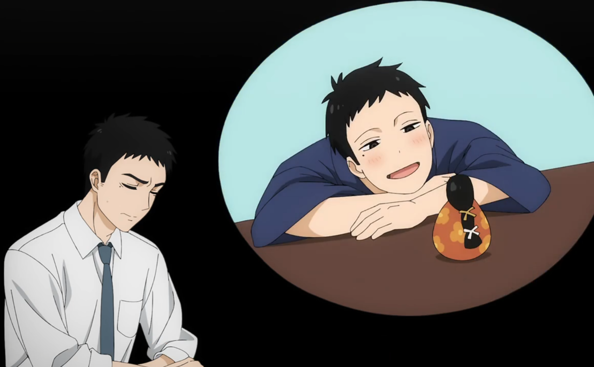

周末看了 Cloverworks 的两部新番——《明日酱的水手服》和《更衣人偶坠入爱河》。这两部动画同一天更新，目前刚出第一集。要不是群里有人聊起这两部动画，我应该不会特意去看。这次刚好可以用一个较为局外人的眼光，作为新番动画的门外汉，来聊聊自己的感想。

## 明日酱的水手服
看动画最直观的感受，就是人物画法上的不适应。应该是原作者画风本就如此，眼睛很精细，眯眼要画成半睁的样子，有棱有角的鼻子等等，都是特色的个人风格。我感觉这应该和古见同学的发型类似，要做出特色。我个人不觉得有更好看，或许平常的萌萌的眼睛鼻子会更讨喜，不过往后看也会习惯吧。可能现在动画画法趋势就是如此呢。

第一集的背景介绍非常好。向往水手服、喜欢小偶像的明日酱升上初中了，之前同年级班上只有她一人，现在终于能见到同龄人了——她正在为能否交到朋友而苦恼。这部分节奏非常欢快，当然，还有这双雀跃的脚丫子，活力率真的明日酱早已跃然纸上。

一方水土养一方人，明日酱的性格折射出的是朴素乐观的乡村生活。如此刻画的日本乡村环境让我想到《悠哉日常少女》。区别于卖萌为主的莲华，明日酱给人的感觉，肯定是要讲些特别的故事的。相似的故事背景让人感慨，日本的少子化也太严重了（笑）。

动画中段讲明日酱和妈妈去买布，妈妈亲手缝制水手服。我对这段感触很深。大概四年前，我们社团几人“创业”做 Lolita 小裙子，做好样衣、请模特拍了样张。那年寒假去日本旅游，我们去东京某处的布料一条街结结实实逛了一个下午。布料店里，颜色和花纹各异的布一筒一筒摞在一起任君挑选。那时候逛布料店的心情，和明日酱多少有些相似吧。

《明日酱的水手服》里的情绪表达是细腻而充沛的。感到寂寞，又替明日酱打气的妹妹，心中夹杂愧疚和鼓励的妈妈，渐渐卸下心防的同学...上学第一天，明日酱系上代表干劲的马尾，也难掩马尾之下的紧张。最终她结交了新朋友，摘下头绳，用最率真的笑容迎接校园生活。非常期待接下来的故事。

## 更衣人偶坠入爱河
很巧的是，这部动画也和做衣服有关。明日酱是妈妈做水手服，这里则是男主做 cos 服。更二次元了！

人设上，男主高高大大的，比起青年更像匠人，代入感就弱了些。类似人设的动画，比如《月刊少女野崎君》和《关于前辈很烦人的那些事》，都有刻意营造体型上的反差萌的感觉。更衣人偶里男主高，女主也不矮，难道是近年来平均身高越来越高的缘故？

男主醉心于日本“传统”艺术雏人形，代入感更弱了。女主请男主做 cos 服，类比国内，大概是请学了十几年国画的同学画本子，或者请木雕世家传人做手办（大雾）。抛开出戏的感觉，作为恋爱剧，男女主偶然相遇、互相欣赏、为共同目标努力的桥段还是很棒的。毕竟二次元也不是什么见不得人的爱好了嘛！

我没正儿八经地看过恋爱剧（电光机王算恋爱剧吗？），第一集看下来，男主五条为什么答应海梦的请求是有铺垫的，并不突兀。五条面对海梦时话都说不利索的木讷也恰到好处。面对海梦的诘问，作为观众的我们自然知道最好要风趣地回复，可五条若是这样做了，就不是“升上高中连朋友都没有只沉迷于雏人形”的 OTAKU 了。虽然男女主这才刚刚认识，但空气中已弥漫着淡淡的甜味，没有发糖胜似发糖。配合海梦直球的性格食用更佳。

班级里沉默寡言的人不再是阿宅，而是小众传统文化的爱好者，有种真实而微妙的错位感。喜欢动画、周边、cosplay 的人可以是、并且更有可能是社交达人。不如说这样的人无论将兴趣放在哪个领域都比常人更加闪耀。现实里，看着社团里的新人，我只能自己感怀一下——阿宅越来越现充，我却越来越宅了。

---

论给人的冲击，前有明日酱确认脚丫味道，后有辣妹当面宽衣解带，不好说哪个更震撼一点。撇开擦边球，这些画面确实高效地刻画了深入人心的角色形象。这也正是动画可以深入探讨的趣味之一。

要说擦边球，我个人也许还是更喜欢废萌软色情那一套吧~（是什么把我变成这个样子的，碧蓝航线吗？）

