上次狂追异世界题材作品（主要是轻小说），还是 16 年看 Re0 的那段时间，我把盾勇、爆肝工程师、骨傲天、转生龙蛋、史莱姆、蜘蛛子、哥布林杀手都翻了一通。回想当年动画，还是魔劣、学战都市等等学院流的余韵，又或者迷家这样很迷的动画XD。后来这些异世界大多都动画化，还有手机侠这样我之前遗漏的，也成为了一段时间的话题。

2021 年的异世界，似乎是无职转生称霸的版本。前几天我和朋友感慨无职转生真好看，他问我动画看到哪了，我说看到第 20 卷（捂脸）。凑巧这季度的几部异世界我都看了，就一并在这聊聊。

## 里亚德录大地
一言以蔽之，这是一部性转骨傲天的故事。女主机缘巧合进入已经停服的游戏世界，根据这个世界的情报，她上次进入游戏已经是 200 年前了。不过在这里，没有和空气斗智斗勇，只余下悠闲融入的异世界生活。

女主之前通过游戏的“养子系统”收养的三个孩子，现在都成了王国里一手遮天的大人物。不止如此，女主自己本就是高玩，等级是突破上限的 1100 级，一身顶级装备和道具也得以保留。当她找到自己孩子的时候，她的孩子们的第一反应是“老妈又要灭掉哪个国家了吗”。魔女的恶名从边境村落到王国都城无人不知无人不晓啊。

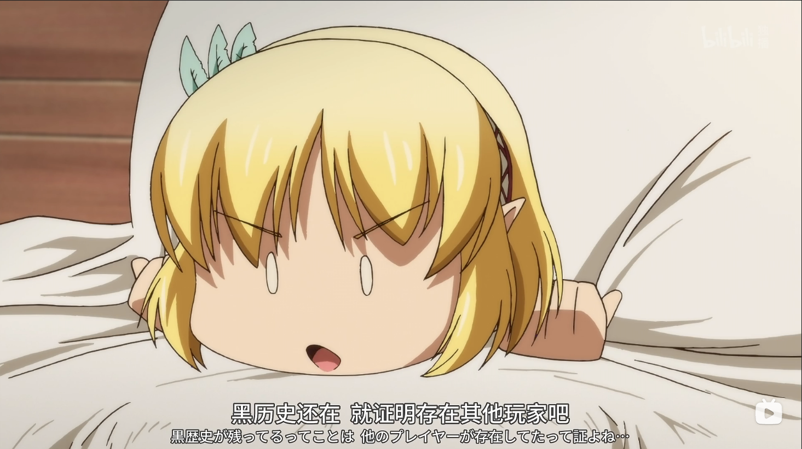

实际上女主只是初来乍到、与人为善的异世界新人而已。她携带的“守护指环”可以激活世界各地的守护之塔，如今的异世界大概也只有她能激活了。这些守护之塔由于多年没有人注入新的魔力，大多被谣传成各种灵异事件和恐怖传说。女主则一边享受生活，一边作为新晋冒险者做一些“微小的贡献”。

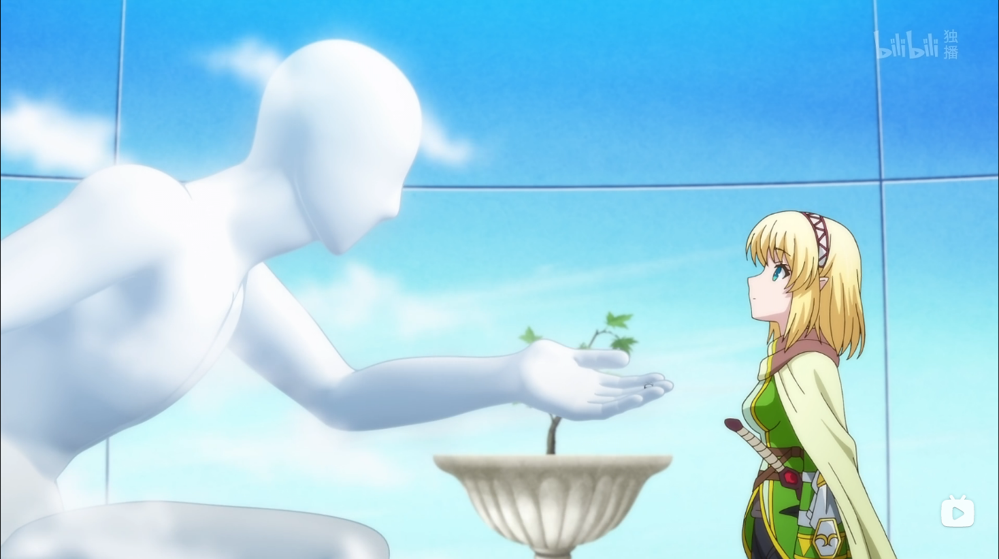

动画里的兽人族，没有刻意走可爱路线，设定成了很普通的样子。又或者说，和平常的猫耳娘相比，是更进一层的 furry。虽说在动画里基本都是背景板，但也多少增添了些异世界的生活感和真实感。动画中场的过场动画，会展示本集出场的主要角色。第一集画了旅馆的小女孩，我还以为她会是整部动画的主要角色，没想到女主突然就换地图了。不过后面可能还会回来也说不定呢？

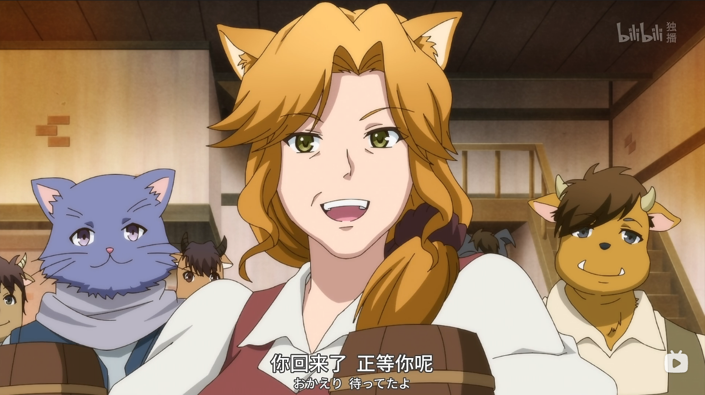

这部动画看弹幕补充背景和设定更增添乐趣，剧情本身也不需要多少理解。有个小缺憾是女主念咒语挺出戏的，既不像网游打怪时那么干练，也不像魔法少女那样华丽，甚至骨王打吸血鬼夏提雅时超位起手、连放 27 个 buff 都要有趣些。毕竟这也只是一部平平无奇的异世界动画，也不能要求太多了。

## 天才王子的赤字国家振兴术
这部动画主角并非穿越，而是传统且套路的龙傲天和白毛女主。看动画前，我就看到有评论说经费都用在女主身上了，不过真要比一比的话，这位远不如《侦探已死》或者《宿命回响》的女主（至少前两集）那么惊艳。我到底有什么奇怪的期待啊！

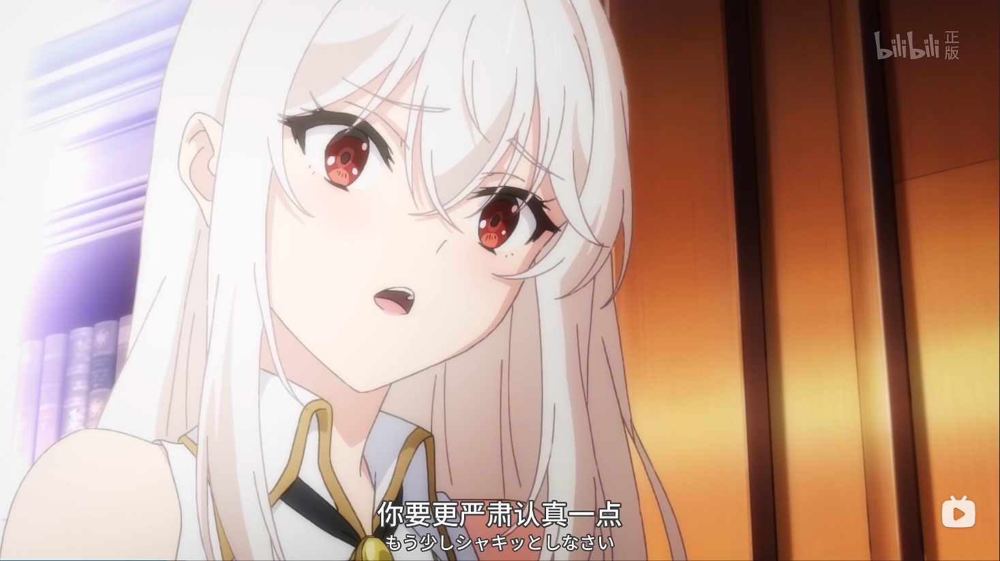

比较好的一点是，女主并非为了白毛而白毛，白发红瞳的设定也有对应的背景。作为套路动画，这部动画的剧情推进还是很不错的。异世界的王子想卖国求富，但也要先经营一番把国家“卖”个好价钱，只是一不小心国家变得太强了（笑）。如果我就是想看北方小国王子扮猪吃虎做大做强，就是想看郎才女貌还有漂亮妹妹，这部动画确实很合适。

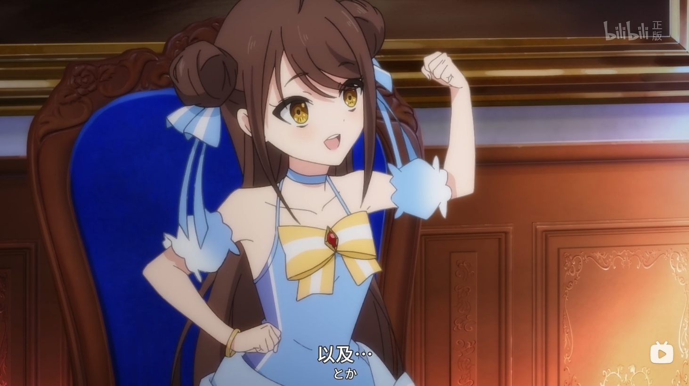

动画实际上带给人的爽感和都市网文是类似的，男主带脑子，基本还讲逻辑，放在网文里也算佳作。另一方面你需要接受动画“确实很贫穷”的战斗和战争场景。或者换个思路，主角不是穿越胜似穿越，作为观众的我们带点玩游戏的视角来看这部动画会舒服很多。比无脑平推强行装x好多了。我对网文又有什么奇怪的偏见啊！

总而言之，这是一部各方面都没有很出彩、但还看得下去的动画。制作组也许确实经费不足，所有本来也没有多大的期待，看动画的时候我也多少有些自知之明了。经费也确实用在了该用的地方，加上弹幕的调侃、设定说明，也可以看得很舒服。每周能让大脑放松二十分钟也可以了。

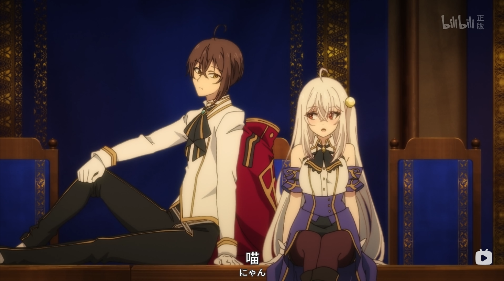

说起来，第一集结尾的猫娘福利，根本不心动啊！

## 与变成了异世界美少女的好友一起冒险
虽然我不明白为什么异世界动画（或者说轻小说原作）都要起这么长的标题，导致我在评论时根本不想再写一遍动画的名字，但是对这部动画来说，就算读了标题也没法想象剧情到底有多欢乐。

如题所见，两位 32 岁的大叔一同穿越到异世界，成为需要打败魔王的勇者，只是其中一位变成了幻想中的金发美少女。为了维持大叔之间的“纯洁”友谊，双方都要忍住内心的悸动、抵抗诱惑、避免陷入爱河。每次男主陷入心动，“对方美少女躯壳里是抠脚大叔”的理性总能把他拽回来；每次女主动了真情，“他是我好哥们不能毁了他”的愧疚也总让她悬崖勒马。这份“扭曲”的感情甚至比辉夜大小姐的设定还合理！

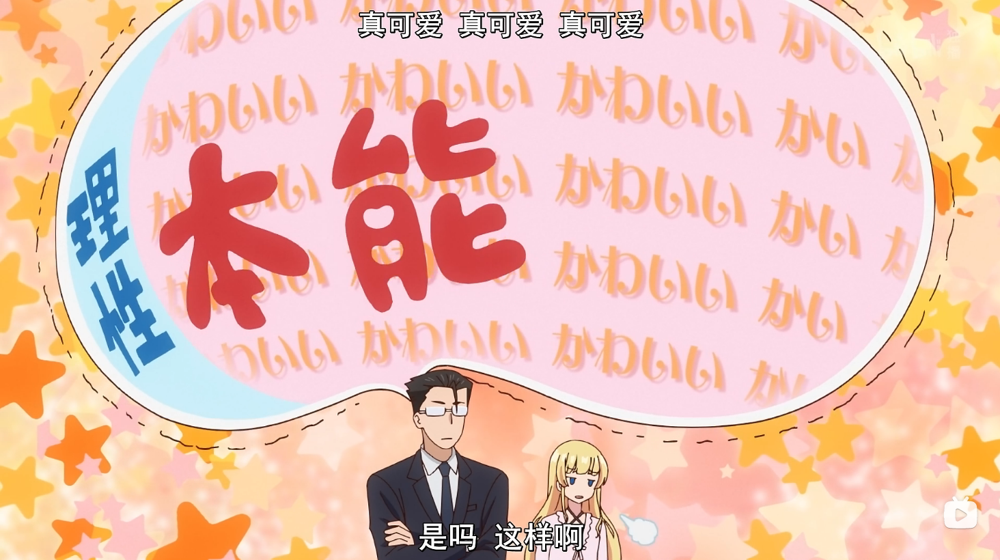

如果说打了 300 年史莱姆那位是社畜福音，那这部就是货真价实的大叔穿越后的恋爱搞笑动画。前面穿越的设定不仅提供笑点，也给剧情推进埋下伏笔。普通的异世界穿越动画只是用“穿越”给主角开点挂，这部动画里的穿越确实给人留下“穿越背后还有阴谋”的感觉。负责穿越的女神就差把阴谋两字写在脸上了。前面看似为了搞笑而加的设定最后可能成为关键的线索，这种感觉埋在搞笑动画之下，更提高了我对它的期待。

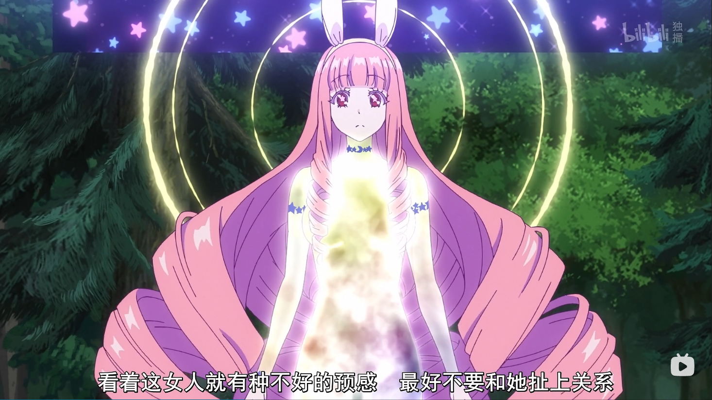

美少女也要衬托。女主漂亮到男主都被魅惑，还有山贼为了抢女主做老婆而内讧的桥段，这些都在观众潜意识种下了女主非常漂亮的种子，本季颜值第一当之无愧。虽然灵魂是大叔，不过男人才更懂男人不是么。我想到一部无关的动画《珈百璃的堕落》，除了珈百璃和女主都是金发，好像没别的相似之处，但他们都能给我们提供一个季度的欢乐。

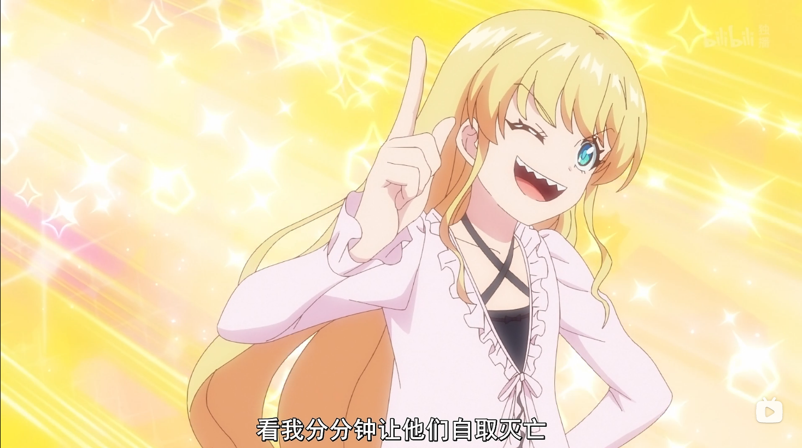

冒险生活是主线，避免恋爱也是主线，还有隐藏在欢乐搞笑之下的暗线，咱们二次元就好这一口。笑点密集，情节紧凑，我本应该非常推荐，但是相比那些爆火、出圈的动画，又好像少了些什么。可惜终究是异世界。

## 自称贤者弟子的贤者
说实话，点开这部动画的时候，我已经意识模糊了。纯粹是想，既然都看了这季度这么多异世界了这部也看一下吧，“来都来了”。

单纯论画面，这部动画也许比前面提到的几部要好一些。白毛主角也非常可爱（比赤字国家振兴术的白发红瞳好很多）。可是为什么在第一集，我要花十几分钟看“邓布利多 + 甘道夫”融合的法师老爷爷打哥布林？

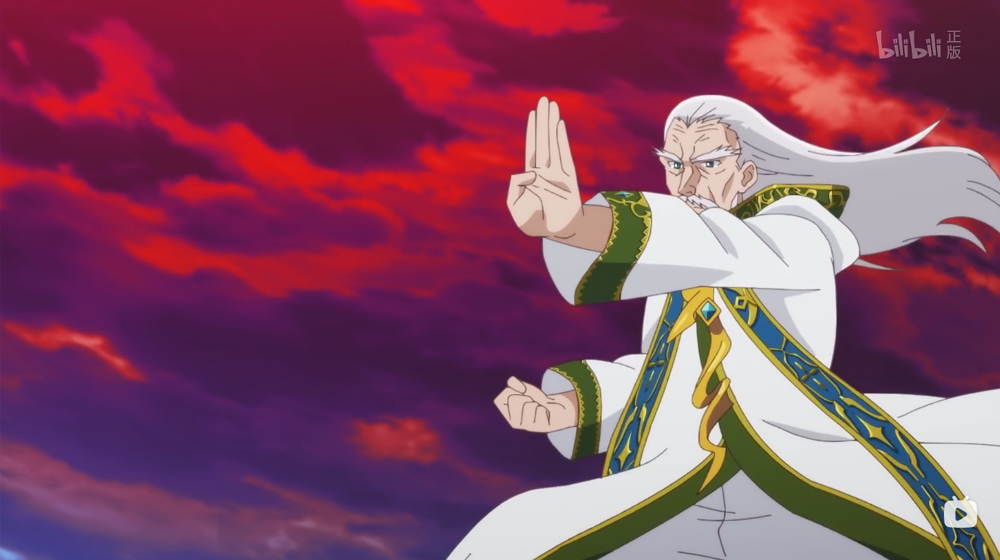

第一集结尾老爷爷变美少女那段全程没有声音，虽说画的不错，但这样的叙述方式让人摸不着头脑。弹幕哥直呼看过原作的人也不知道监督在画啥。到第二集好家伙，装甲车和电话都出来了，这还是剑与魔法的异世界吗？以上种种燃起了我去看原作小说的欲望。

看了小说第一卷，我想说两点。第一，动画前几集讲的事情和小说前面讲的内容，确实毫无关系，就好像小说作者和动画监督用同一堆积木搭了两个截然不同的玩具。第二，这作品在设定上确实是究极缝合怪，网游、穿越、魔法、科技等等都往里面缝，还能感受到作者努力描绘异世界风情的心意。但我好像没法就这样轻松愉悦地全盘接受，何况动画前几集也没在好好讲设定，老爷爷为啥变美少女还没讲清楚呢。

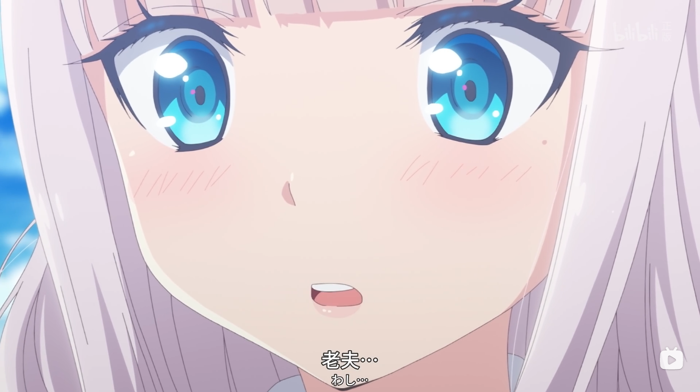

有统一的一点是主角变成美少女之后还是习惯自称“老夫”，这也是动画另一个标题“老夫真可爱”的由来。本应该是挺有趣的一部作品,我却没能够好好看下去。

---

以上几部动画都没到“非看不可”的程度，在此我也不做过多推荐了。当我们说“异世界动画大行其道”的时候，指的就是这些“平均水准”的动画吧？我们对异世界动画的期待，和我们对日本动画的期待，是否有所不同呢？2022 年的异世界动画又会何去何从？

看动画的同时我也不免在想，我是否有必要看这些也许不会看完、也许过几个月就无人问津的动画呢？我也对自己当前所做之事是否有意义进行了一番思考。

又或许，这些都不是问题，如今还能安心看几集动画就足够了。

P.S. 和我一起看异世界动画，一起刷超位起手！
