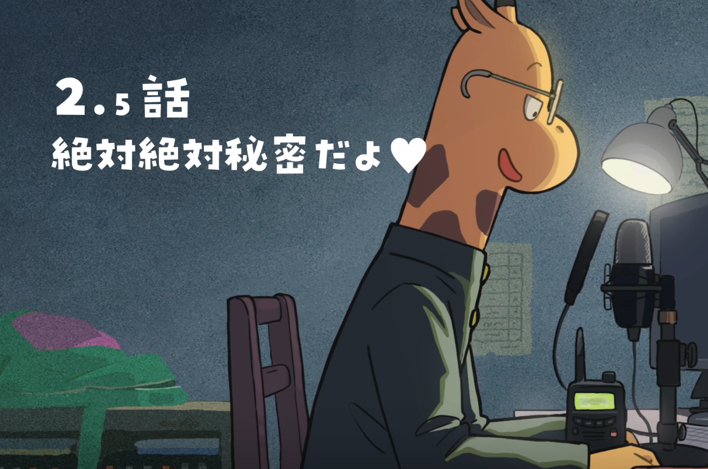
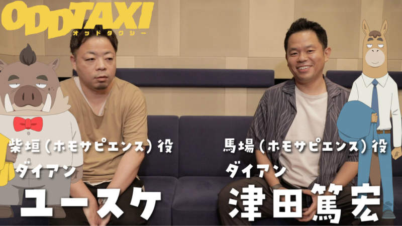
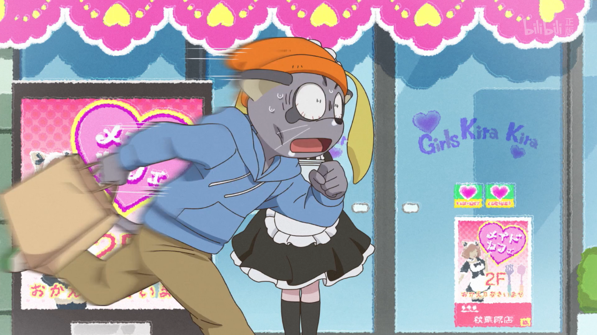

《ODD TAXI》是 2021 年各方面都很新颖的一部动画，它并没有特别高超的绘画制作，相反有些单薄，它的故事却异常引人入胜。令人惊喜的巧妙设计，入木三分的角色刻画，还有动画之外的联系，都让人直呼过瘾。

## 不同寻常的制作
《ODD TAXI》在制作上部分采用了先配音再配画面的方式，在整个动画业界，也只有《摸索吧！部活剧》等寥寥几部动画尝试过类似的方法。这样做的好处是语音和对话更自然，声音和画面契合度也会更高，当然这对配音台本以及声优即兴表演的要求也要更高。（这种方式并不契合当下动画制作的流程。）

说到配音，这部动画和搞笑艺人有千丝万缕的联系。其中狗警官大门兄弟、“智人”组合，居酒屋的袋鼠妈妈桑，还有哗众取宠的河马 Youtuber，都是由搞笑艺人配音。脚本此元和津也之前名作《濑户内海》也是漫才漫画。动画有浓厚的漫才感，搞笑艺人表演的漫才类似相声和脱口秀，语言上的表现力突破天际。相比其他动画，《ODD TAXI》的对话频率要快很多，更趋近漫才的节奏。这么看来事前录音也可以说是歪打正着。

动画配套的广播，名为《长岛广播电台》，设定上是那位每期都给搞笑组合写信的长颈鹿高中生拦截到某个窃听器所记录的秘密对话，映照着那个将小户川卷入其中的漩涡。窃听器是谁的手笔？每期广播剧“透露”的秘密又揭露了漩涡之下怎样的暗流？和这些疑惑相比，动画所呈现的群像也好像只是冰山浮出水面的那一小块了。

起初我不知道有广播这回事，现在回头去听就感觉脑子有些转不过来。在这里我还是主要聊聊动画里的一些有趣之处。

## 搞笑艺人的写照
动画里有一个搞笑艺人组合“智人”，其中野猪叫柴垣，马叫马场。给他们配音的是组合“黛安”，他们是地从关西前往东京发展的组合，和“智人”一样处在低迷期。给柴垣配音的黛安佑介现实中说话语调和性格都与剧中十分相似,或许在选角时真的是照着配音演员去画的角色。

吉本兴业，则是几乎垄断日本搞笑事业的巨无霸，这部动画可以看作吉本兴业涉足动画的尝试。上面提到的搞笑艺人都是吉本兴业旗下，动画里几位小偶像也是由吉本兴业签约的声优艺人配音。在动画里我们能看到搞笑名宿吞乐在电台里肆无忌惮地吐槽以及毫不在意地暴露自己的家丑，从这个角度看来有些像作为动画制作的乙方吐槽甲方，又或者是公司的匿名吐槽。小户川在桑拿房遇见的纹身大叔，也可以说是吉本兴业“自己画自己”了。

我对日本的搞笑艺人不熟，不过在看动画之前，我读的《东京百景》恰好是搞笑艺人又吉直树所写（当然他也是吉本兴业所属）。他的处女作《火花》曾拿下芥川龙之介奖。在《东京百景》里，他描绘了一个来东京打拼的年轻搞笑艺人视角下的东京，其中也常提及搞笑艺人的日常辛酸。在没有名气的时候，又吉直树也住在类似棚户房、群租房的地方，要在过道上打水，和别人共用卫生间，见识人生百态。又吉直树在其中一节提到三鹰下连雀二丁目的木房子，是他在东京的第一处落脚之地。后来他才知道这木房子是太宰治曾住过的地方。他恰在这里读了许多太宰治的作品，物质上虽然贫瘠，精神上却很浪漫了。

动画里的“智人”组合，既要一边运营不温不火的电台节目，又要努力准备“N-1 漫才大赛”（neta 现实中的 M-1 漫才）以搏出位，还要去夜总会打工维持生计。这种辛苦也是这个行业的真实写照。四月我辞职回家时，恰逢《ODD TAXI》开播，我正是在成为家里蹲的第一个月，在寂静无光的夜晚看完了这部动画。有数不清的人在大都市挣扎，有的是默默无闻的螺丝钉、籍籍无名的润滑油，有的只是可有可无的烟尘。有的人得以留下，而我恰是落荒而逃的其中之一罢了。

## 巧妙构思的群像
作为群像，柴垣和马场的着墨其实不多，但却是我感触最多的角色。其他角色的刻画也很精彩，比如很多人念叨的氪金魔怔人田中，动画用了一整集的篇幅讲述了看似和剧情无关的田中的故事，其中还有大量田中童年时期的回忆。这“突兀”的一集单拎出来已经非常完整，同时又埋着许多后期串起来的线索。

动画明面上的主角小户川，是一根把故事主要角色串起来的线。他是许多事情的旁观者、过路人，以及少部分事件的参与者。在小户川视线未及之处，故事的其他“主角”们还有另外的联系。比如被小偶像包养的马场，黑帮的业务与竞争等等。据说动画最初的脚本有二十多集，制作组“忍痛割爱”删减到十三集堪堪把故事讲完。那些删去的部分可以在广播《长岛广播电台》里窥得一二，同时也可以期待今年四月剧场版的新故事。

同样以东京为背景，相比《无头骑士异闻录》，《ODD TAXI》作为群像更加贴近生活。无头讲都市传说，《ODD TAXI》 讲社会悬疑。它利用群像构造错综复杂的悬疑迷宫时，也生动地刻画了每一个角色的人物弧光。我们一边惊讶于剧情的奇诡发展，又在不经意间为某个角色感同身受。同时《ODD TAXI》充分发挥了动画的优势。你无法通过文字演绎身临其境的漫才，也无法通过真人表演小户川眼中的动物们，这是其他载体无法讲述的独特故事。