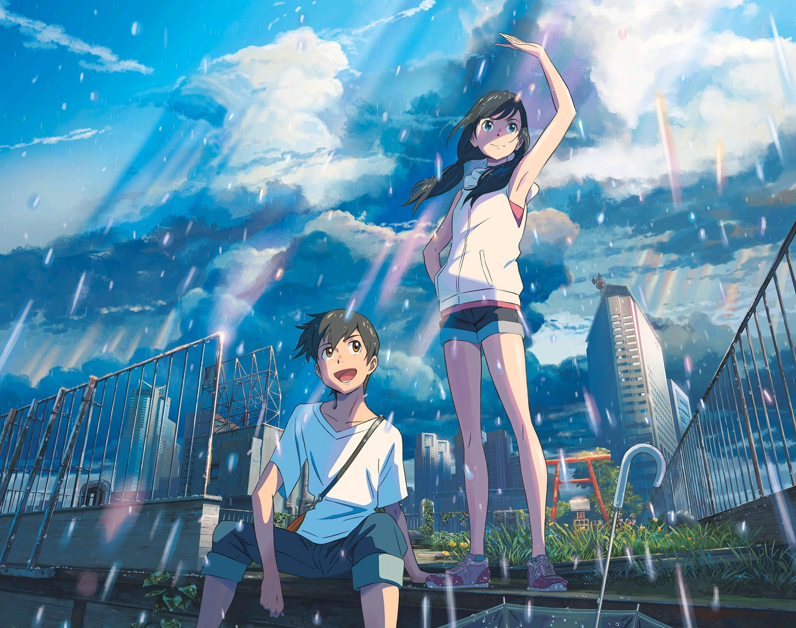
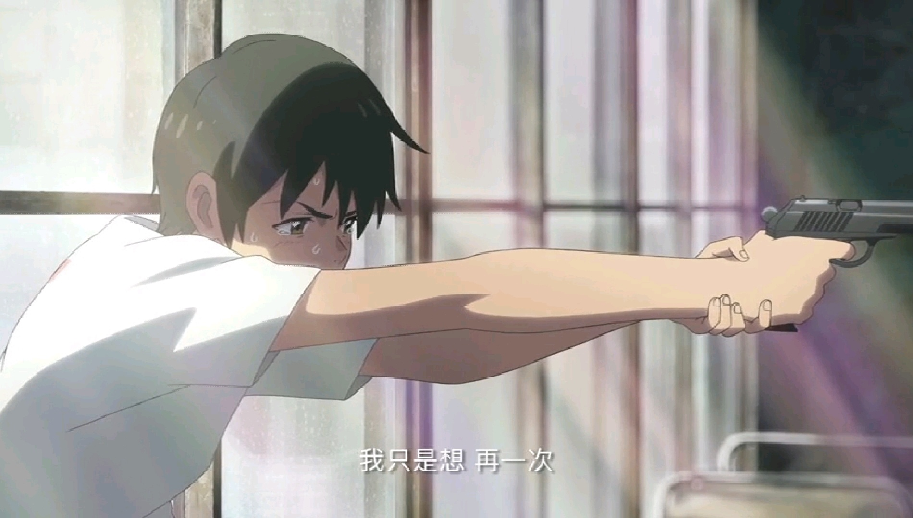
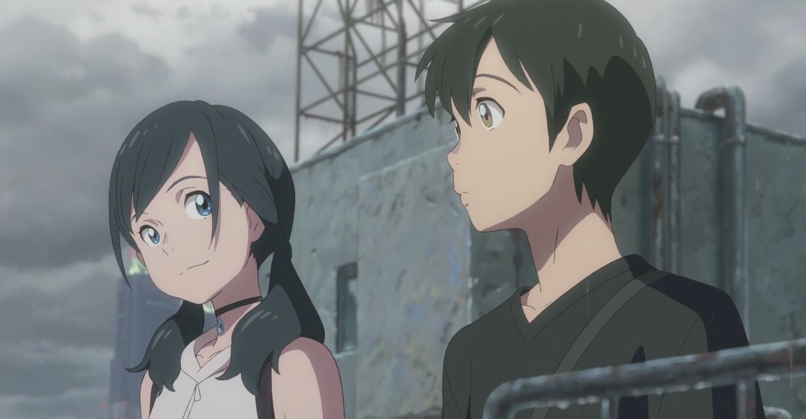
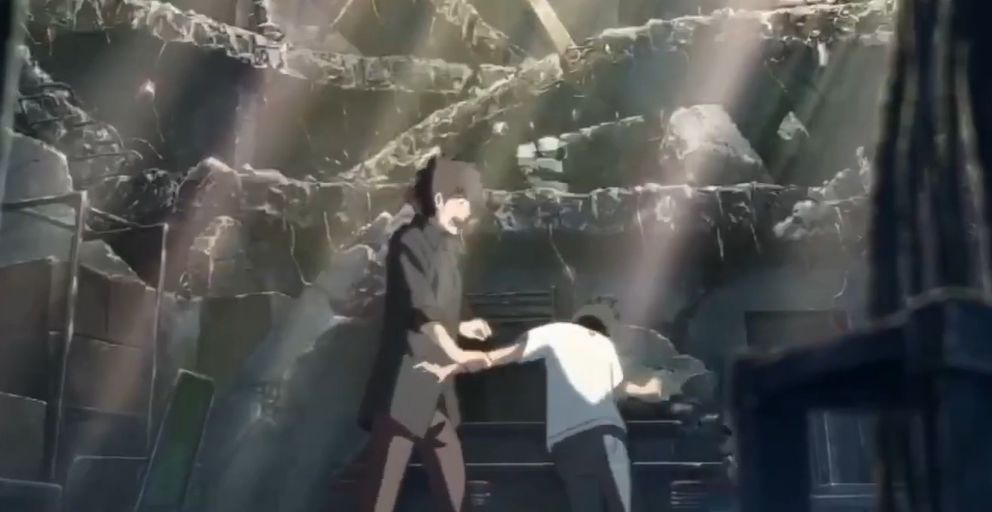
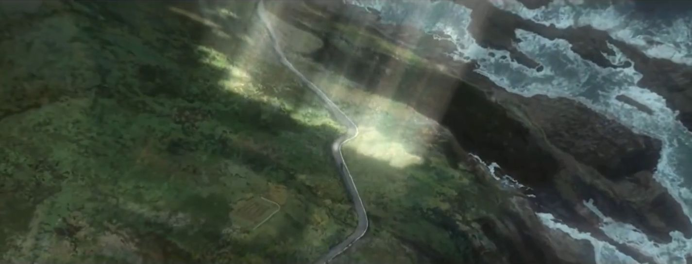
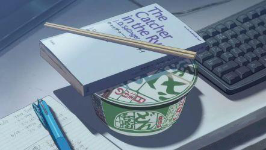
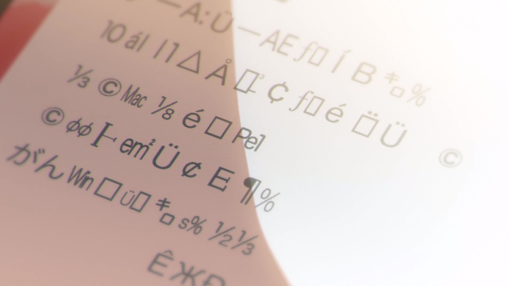
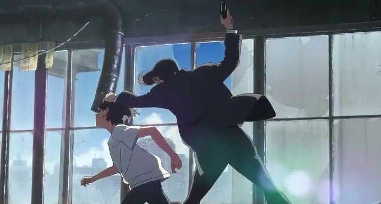

故事发生在暴雨连绵的东京，停不下来的雨带给人的压抑要多过清新。阴沉的天幕下，离家出走的少年和带来晴天的女孩相遇、相恋。恰巧在电影上映的期间，另一部作品《死亡搁浅》中，雨也扮演着重要的角色。我承认最初只是因为他们宣传时间相近才生出了比较一番的心思，回想起来，他们之间的“相似”实在有些微妙。

## 两次开枪与两次误解
和少年对立的是成年人。成年人遭受过社会的毒打，认识了世界，遵循社会规则并且向权威和规则妥协。现实不是二极管，成年人也可以拥有“少年感”，也具有抗争精神，少年也会老成和妥协。可是我们的男主，一定是百分百的少年。

站在帆高的视角，他常常不被别人、尤其是大人们理解，这时他捡到一把枪，他认为枪可以帮助他获得话语权，获得被理解的资格。

男主帆高在电影里开了两次枪。第一次他莽撞开枪，女主阳菜质问他：“你怎么可以开枪呢！”纵使帆高想要解释自己是想把她从“坏人”手中救出，也只得哑口无言。而后阳菜回来关心帆高脸上的伤，也不需要再解释帆高为何开枪了。我甚至过分地理解为：女主并不在意男主为何开枪，只在意男主是否关心她；男主也没有从女主处得到关于“为何开枪”的理解，只需要达到搞好关系的目的就行。开枪只是意外，撇开枪击，这又何尝不是男女交往时常常经历的微妙心理变化呢。

阳菜回来关心帆高，还一起上天台了，啊我酸了。

第二次，帆高因为不被大人理解而开枪。警察们无法理解一个离家出走、携带枪支、有诱拐嫌疑的小孩喊着“她在天上，我要去带她回来”是什么意思。相比理解帆高，我们更能理解警察叔叔们的立场。作为观众的我们即便明白阳菜消失的缘由，也会囿于“开枪是危险、违法的”这样的观念而支持大人们。就像编辑部大叔说的那样，“听话一次”就好了。

如果大家坐下来好好谈谈就可以解决问题，故事根本就不会发生吧。

可是，也许只要“听话”一次，故事就会戛然而止。作为观众，我们“需要”男主去反抗、去推进剧情。如果男主不离家出走、不逃跑、不开枪、不反抗，不会有人遇到问题，帆高就是普通中学生，没有主角光环，东京淹没也和他没有半毛钱关系。作为男主，帆高只要顺从一次，属于他和阳菜的爱情就无法诞生。

《死亡搁浅》开场时这样说：

> Once, there was an explosion... A bang which gave birth to time and space
>
> 从前曾发生过一次爆炸... 时间和空间在那一刻诞生
>
> Once, there was an explosion... A bang which set a planet spinning in that space
>
> 从前曾发生过一次爆炸... 有个星球在爆炸后诞生并自转
>
> Once, there was an explosion... A bang which gave rice to life as we know it
> 
> 从前曾发生过一次爆炸... 生命在爆炸后繁衍生息
> 
> And then came the next explosion
> 
> 后来又发生了一次爆炸

几次“爆炸”，推进了人类的进程；几次“开枪”，也推进了帆高的人生。“爆炸”是宇宙的意外，其后生命巧合地降临于星球；“开枪”是人生的意外，爱情恰在意外中诞生。这正是世界系偏爱的叙述方式吧。如果看电影时把 BGM 换成《Don't Be So Serious》肯定别有一番风味。

帆高有说过自己是追逐这束光才离开了家。我们指责帆高的根源在于，我们从一开始就不理解他，更多的是站在社会的角度指责他。可是故事也是基于此才发生。

## 少年的天真勇猛
我们可以把《天气之子》理解成一个“天真单纯的少年通过自身的勇猛，对抗自然法则，收获爱情”的童话故事。《你的名字》也可以从这个角度理解。

为什么要强调少年的勇猛呢？正因为是少年，才会叛逆地离家出走，才会相信自己的勇敢会有回报。少年们怀着朴素的善良观，会勇于抵抗自身所认定的“恶”。简单来讲就是莽。（身为主角，莽过去有什么不可以的嘛？）

男主帆高手边那本《麦田里的守望者》，也算是铺垫了少年时期的叛逆吧。

强调童话，是因为这种题材通过丰富的幻想和简单的逻辑来反映生活。比如阳菜可以“召唤”晴天，居然没有被科学家抓去做实验？帆高居然这么轻易就找到一把手枪？东京警察找一个离家出走的少年居然这么费劲？故事里很多细节是经不起逻辑推敲的。手枪起码做了一定程度的铺垫，可是对政府、警察的弱化和无视对比，仍旧突兀了。这些情节对剧情来说不能避过，只能淡化处理，最后展现出来的就是一个“少年展现自身单纯勇猛并且收获爱情”的故事。

这种出戏感在《你的名字》里也不是没有——我一直觉得泷站在山顶、手机信息变成乱码槽点太多了。（可能是因为在理科生眼里乱码不该这样画…）

在《你的名字》里，主角面对的主要危机是陨石，而在《天气之子》中，困难变成了大人们。

《你的名字》里，身为镇长的父亲并不相信陨石的预言，于是我们支持三叶去炸电厂、谎报火灾疏散群众的谋划，并且希望他们成功。可是在《天气之子》里，我们却很难支持帆高为了寻回阳菜而冲动开枪的行为。不仅仅是我们不支持，电影里几乎没有人理解。

也许应该说，我们会喜欢一个莽送快递的游戏——我们可以喜欢任何莽过去的游戏，但我们很难喜欢一个全靠莽的恋爱故事。

---

看完《天气之子》，我最直观的感受是他的音乐没有《你的名字》那么恰当。可以理解在《你的名字》中动画和音乐相得益彰，都取得了辉煌的成绩，因此在《天气之子》中更加突出音乐的地位，却有些“喧宾夺主”了。电影中推进剧情、交代故事、渲染气氛、表达情感等等，许多都用音乐带过，就像看了许多绘画精美的 MV。这样失去重点的情形在画面上也有体现，过于精细的画面反而会让人怀疑它到底想表达什么。毕竟不是为了给人截屏作壁纸才拍的电影嘛。

当然，有力的音乐和优秀的画面在影片最高潮的部分、主角两人从天而降的场景，结合得非常好，带给我的是近乎完美的震撼体验。

我想再夸一句我认为电影里最出彩、最有趣的角色——夏美。夏美姐成熟俏皮，性感活泼，英勇可靠，一切你能想到的和大姐姐有关的美好词语都可以拿来形容她。也许也有一丝“女生比较早熟”的暗示在里面吧。如果不讲天气之子的故事，而是讲夏美为主角的故事，我肯定会喜欢的。